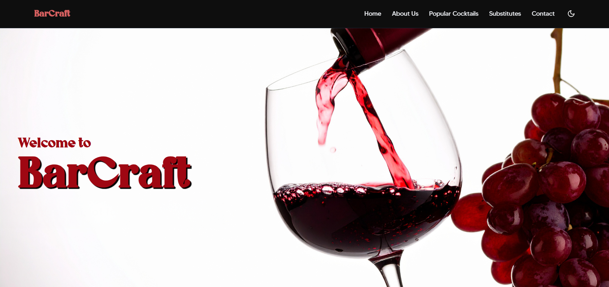
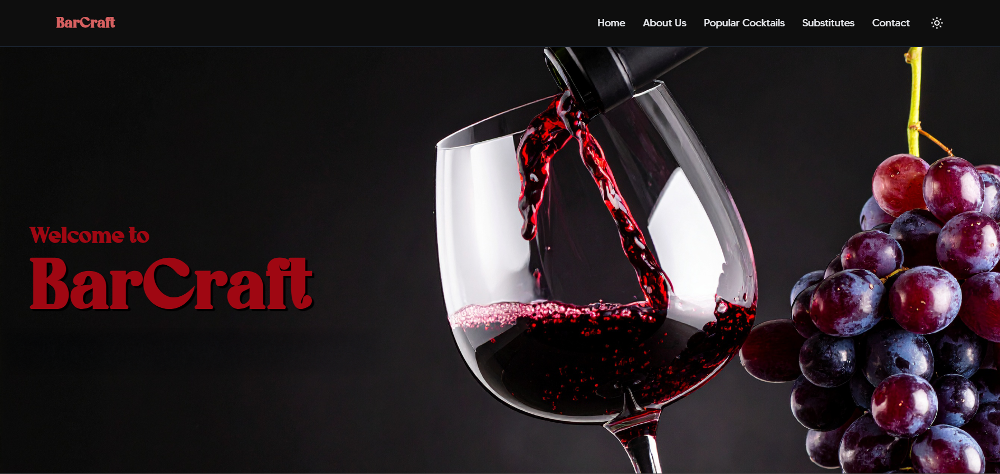
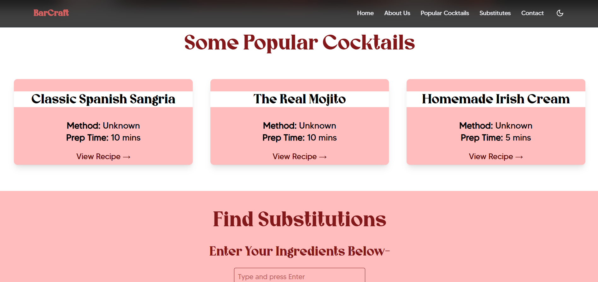
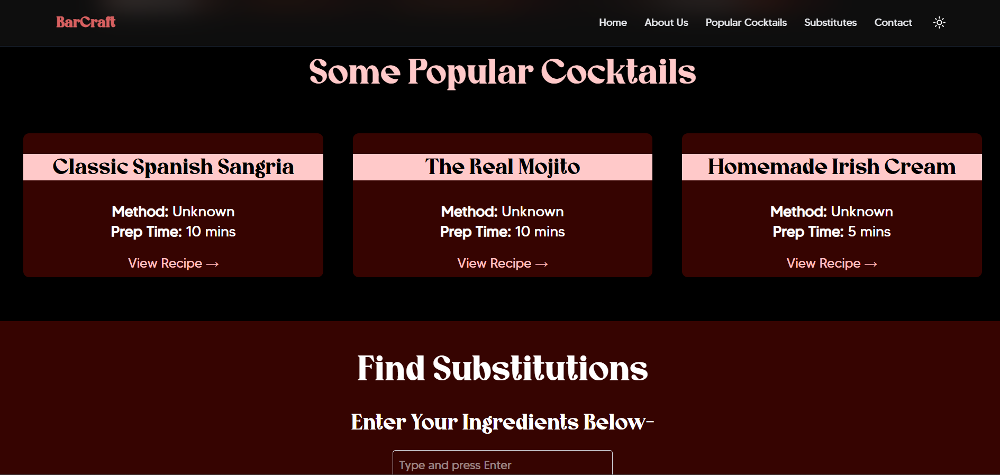

# BarCraft
---

A fast & modern cocktail discovery web app built with React, Vite, and Tailwind CSS. Users can search for cocktails, view detailed recipes, and find ingredient substitutes. Designed for responsiveness and future expandability using clean architecture.

---

## Tech Stack

| Tool            | Purpose                                                                 |
|------------------|-------------------------------------------------------------------------|
| React.js         | UI framework for building components                                    |
| Vite             | Build tool for fast development and hot module reload                   |
| Tailwind CSS     | Utility-based CSS for styling responsive UIs quickly                    |
| React Router     | Adds navigation between pages without full reload                       |

---

## User Interface

| Light Mode | Dark Mode |
|-----------|------------|
|  |  |
|  |  |

---

## Getting Started

### 1. Clone the repository

```bash
git clone https://github.com/your-username/cocktail-app.git
cd cocktail-app
````

### 2. Install dependencies

```bash
npm install
```

### 3. Start the development server

```bash
npm run dev
```

Visit **[http://localhost:5173](http://localhost:5173)** in your browser.

---

## Project Structure

```
cocktail-app/
├── public/             # Static assets
├── src/
│   ├── assets/         # Visual assets such as images, videos, fonts etc.
│   ├── components/     # Reusable components (e.g., Navbar, Card)
│   ├── context/        # Global state
│   ├── data/           # Data about ingredients (tentative)
│   ├── pages/          # Pages (Search, Details, Substitutes, etc.)
│   ├── App.jsx         # App layout and nav
│   ├── App.css         # App layout and nav
│   ├── main.jsx        # App entry point
│   └── index.css       # Tailwind CSS entry
├── tailwind.config.js  # Tailwind configuration
├── index.html          # Layout
└── README.md
```

---

## Features

*  Search cocktails by name
*  View detailed recipes and instructions for popular cocktails
*  Suggest ingredient substitutes
*  Responsive UI using Tailwind CSS
*  Fast Vite development environment

---

## API Usage

You can connect to public APIs-

Example (with `fetch()`):

```js
fetch('https://api.example.com/cocktails')
  .then(res => res.json())
  .then(data => console.log(data));
```

Example (with Axios):

```js
import axios from 'axios';

const fetchCocktails = async () => {
  const res = await axios.get('https://api.example.com/cocktails');
  return res.data;
};
```
---
### Project Advisor
Prof. Ganesh Bagler

### Contributers
- Anouska Sahoo
- Paridhi Kotarya

We hope you enjoy using BarCraft as much as we enjoyed creating it!


```
  _
 {_}
 |(|
 |=|
/   \
|.--|
||  |
||  |    .    ' .
|'--|  '     \~~~/
'-=-' \~~~/   \_/
       \_/     Y
        Y     _|_
       _|_
```
