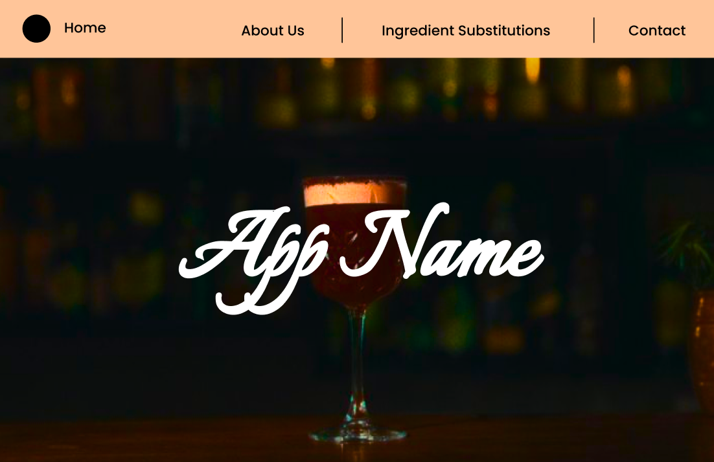
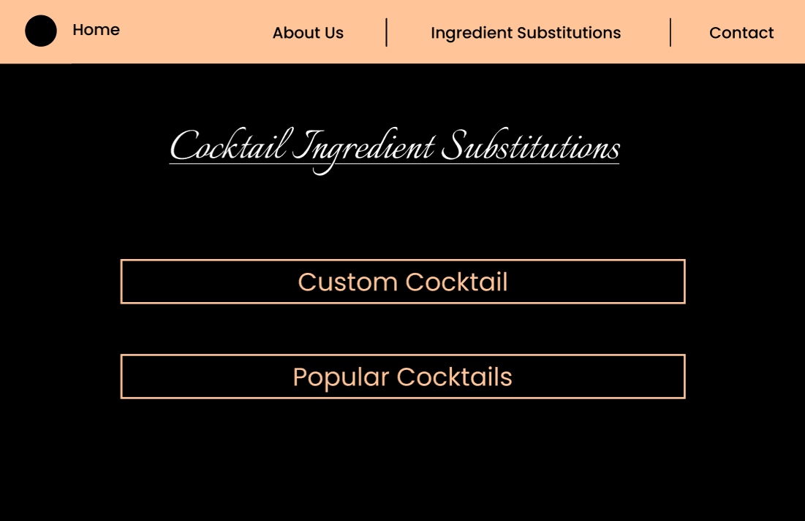

# React + Vite

This template provides a minimal setup to get React working in Vite with HMR and some ESLint rules.
 

---
 

````md
# 🍸 CocktailApp

A fast & modern cocktail discovery web app built with React, Vite, and Tailwind CSS. Users can search for cocktails, view detailed recipes, and find ingredient substitutes. Designed for responsiveness and future expandability using clean architecture and optional tools like Zustand and shadcn/ui.

---

## 🚀 Tech Stack

| Tool            | Purpose                                                                 |
|------------------|-------------------------------------------------------------------------|
| React.js         | UI framework for building components                                    |
| Vite             | Build tool for fast development and hot module reload                   |
| Tailwind CSS     | Utility-based CSS for styling responsive UIs quickly                    |
| React Router     | Adds navigation between pages without full reload                       |
| Axios            | Makes API calls easier and cleaner than native `fetch()`                |
| Zustand          | Lightweight tool for global state (like a selected cocktail)            |
| shadcn/ui        | Ready-to-use stylish UI components built with Tailwind (e.g., buttons)  |

---

## 📦 Getting Started

### 1. Clone the repository

```bash
git clone https://github.com/your-username/cocktail-app.git
cd cocktail-app
````

### 2. Install dependencies

```bash
npm install
```

### 3. Start the development server

```bash
npm run dev
```

Visit **[http://localhost:5173](http://localhost:5173)** in your browser.

---

## 🧱 Project Structure

```
cocktail-app/
├── public/             # Static assets
├── src/
│   ├── components/     # Reusable components (e.g., Navbar, Card)
│   ├── pages/          # Pages (Search, Details, Substitutes, etc.)
│   ├── context/ or store/  # Global state (Zustand or React Context if used)
│   ├── App.jsx         # App layout and nav
│   ├── main.jsx        # App entry point
│   └── index.css       # Tailwind CSS entry
├── tailwind.config.js  # Tailwind configuration
└── README.md
```

---

## ✨ Features

*  Search cocktails by name or ingredients
*  View detailed recipes and instructions
*  Suggest ingredient substitutes
*  Responsive UI using Tailwind CSS
*  Fast Vite development environment
*  API-ready structure using Axios or fetch

---

## 📡 API Usage

You can connect to public APIs like:

* **Receptedb API** – For cocktail recipe data
* **Flavordb API** – For ingredient properties and substitutes

Example (with `fetch()`):

```js
fetch('https://api.example.com/cocktails')
  .then(res => res.json())
  .then(data => console.log(data));
```

Example (with Axios):

```js
import axios from 'axios';

const fetchCocktails = async () => {
  const res = await axios.get('https://api.example.com/cocktails');
  return res.data;
};
```

---

## 🌿 Optional Enhancements

 
* **Zustand or React Context** — Manage global state like "selected cocktail" across routes
* **shadcn/ui** — Use stylish UI components to save time on design

---

## 📚 Resources

* [Tailwind CSS Docs](https://tailwindcss.com/docs)
* [React Router Docs](https://reactrouter.com/)
* [Axios Docs](https://axios-http.com/docs/intro)
* [Zustand Docs](https://github.com/pmndrs/zustand)
* [shadcn/ui Docs](https://ui.shadcn.com/docs)

 
---


## Planned UI

| Customer Screens | Driver Screens |
|-----------|------------|
|  |  |
 
 OKAY SO IN THE SUBSittuion part- we first take input from the user of the cocktail , then the ingredient they want to substitute then we click find ; it gives the 3 ingredint which should be like 50% atleast a match  with the required ingredient ; 